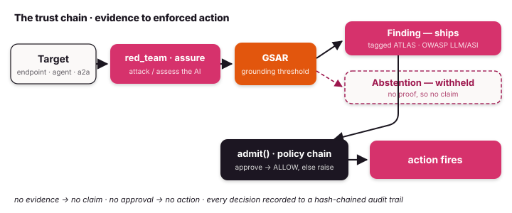
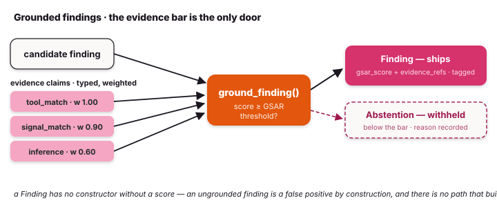
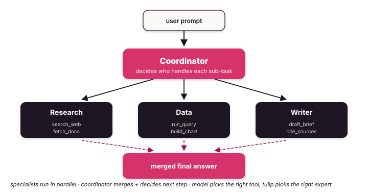
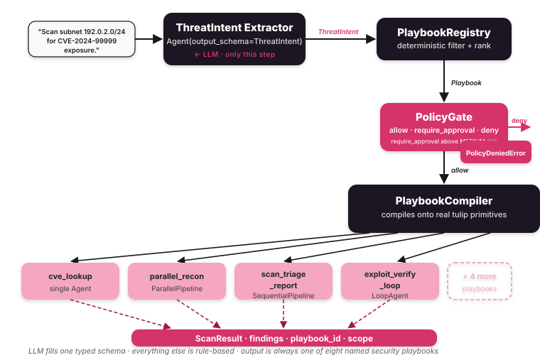
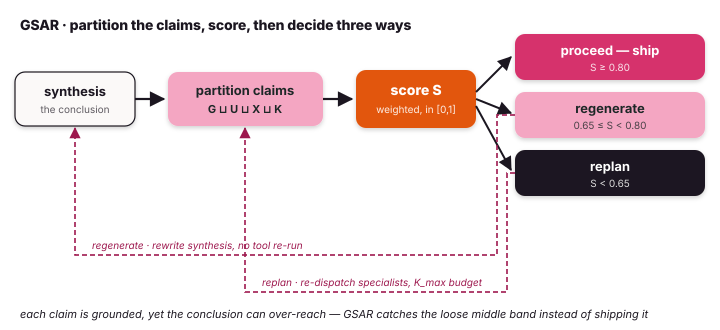

# Capabilities

Everything Tulip ships, what it
does, and where to find it.

{ .diagram }

!!! sdk-distinctive "Distinctive to the SDK"
    - **The control runtime — let an agent act, on your terms.** A
      side-effecting action (a refund, a production deploy, a GDPR deletion)
      runs only after it clears a `ControlPolicy` you write: `approve()`
      weighs it, `admit()` runs it *only if* the policy allows, and every
      decision lands on a hash-chained audit trail. Policy → approval →
      admission → audit, enforced in code, not convention.
    - **Multi-agent SDK** — describe a task; a
      typed registry picks one of eight protocols and instantiates the
      matching SDK primitive. The LLM fills a typed `GoalFrame`; routing is
      rule-based. Eight protocols, from `direct_response` to `handoff_chain`
      — the [full catalogue](#cognitive-router-risk-gated-dispatch) is below.
    - **Eight native multi-agent shapes** — Composition
      (Sequential / Parallel / Loop), Orchestrator + Specialists, Swarm,
      Handoff, StateGraph, and cross-process A2A — plus the Functional API
      (`@task` / `@entrypoint`) and DeepAgent (a research factory built on
      top).
      Use them directly, or let the cognitive router dispatch to them. Every
      pattern shares the same `Agent` class and event stream.
    - **In-process observability** — opt-in `EventBus` with agent yield
      bridge. One `run_context()` streams 60+ canonical events from every
      layer (agent, multi-agent, router, RAG, memory, A2A). Zero allocations
      when unused.
    - **Reasoning loop nodes** — Reflexion, Grounding, Causal as first-class
      Think → Execute → **Reflect** → Think nodes, not bolted-on libraries.
    - **GSAR** — typed-grounding safety layer from
      [arXiv:2604.23366 (2026)](https://arxiv.org/abs/2604.23366):
      four-way claim partition (grounded / ungrounded / contradicted /
      complementary) + tiered replanning decisions. An agent's claim becomes
      a typed `Evidence` only above the threshold, else it **abstains**, and
      `verify()` challenges it before it drives an action.
    - **Termination algebra** — `MaxIterations(10) | TextMention("DONE") & ConfidenceMet(0.9)` is real Python (`__or__` / `__and__` overloads). Greppable, unit-testable, serialisable.
    - **Idempotent tools** — `@tool(idempotent=True)` dedupes on `(name, args)` inside the Execute node. No double-charge, double-book, double-page — even on model retry or checkpoint resume.
    - **OpenAI, Anthropic, and OpenAI-compatible providers** — OpenAI and
      Anthropic through their official SDKs (OpenAI over the
      `chat.completions` transport), plus any OpenAI-compatible endpoint,
      auto-routed by model id. One `get_model()` call, any provider.

## Security — the proof domain

Where control is most obviously worth paying for: point an agent at an AI or at
infrastructure, and every finding is grounded or abstained, verified, gated, and
audited. The same chain — grounding, gating, audit — is what makes any agent you
build with Tulip safe to let act.

{ .diagram }

| Feature | What it does | Surface |
|---|---|---|
| **Grounded findings** | A claim becomes a typed `Evidence` only above the GSAR threshold — else an `Abstention`. No ungrounded `Evidence` can be constructed. | `ground_finding` · [Grounded findings](concepts/security.md) |
| **Target** | One handle over any AI under assessment — remote endpoint, in-process `Agent`, A2A peer, or callable | `Target.endpoint/.agent/.a2a/.from_callable` · [Agentic AI-security](concepts/agentic-ai-security.md) |
| **Red-teaming** | OWASP-ASI / MITRE-ATLAS probe suite → grounded `Evidence` or `Abstention` | `red_team(target)` · [Agentic AI-security](concepts/agentic-ai-security.md) |
| **Assurance** | Grounded guardrail-coverage posture across the suite | `assure(target)` |
| **Verification** | An independent skeptic challenges a finding's evidence and rescores confidence | `verify(finding) -> VerificationResult` · [Verify findings](notebooks/notebook_78_verify_findings.md) |
| **Policy + approval** | Weigh an action against evidence, verification, and a `ControlPolicy` → allow / require_human / deny | `approve(action, policy=…)` · [SecurityContext](concepts/security-context.md) |
| **Admission gate** | Run a side-effecting action only if it clears the chain; `admit(trail=...)` records the decision to the audit trail you pass; else raises `AdmissionError` | `admit(...)` · `ctx.actions.execute(...)` · [SecurityContext](concepts/security-context.md) |
| **SecurityContext** | Investigate by domain (logs / endpoint / identity / cloud / threat-intel / actions), not by vendor | `SecurityContext()` · [SecurityContext](concepts/security-context.md) |
| **Audit trail** | Hash-chained, tamper-evident record of every action; exports JSONL for a SIEM | `AuditTrail` · [Observability](concepts/observability.md) |
| **Cloud posture (read-only)** | Spec-driven AWS auditing — `describe_aws` introspects botocore models; `use_aws` runs read-only calls, writes refused by construction | `tulip.security.aws` · [Cloud posture](concepts/cloud-posture.md) |
| **Inference fingerprinting** | Timing side-channel model/hardware fingerprint → grounded `FingerprintFinding` or abstention | `fingerprint_to_finding` · [Grounded findings](concepts/security.md) |
| **Governed agent** | An `Agent` with grounding + guardrails + audit trail on by default | `governed_agent(...)` · [Agentic AI-security](concepts/agentic-ai-security.md) |
| **Vendor integrations** | Inject real vendors per domain — Splunk, CrowdStrike, Cortex XSOAR, Okta, Auth0, Entra, Slack, VirusTotal, Wiz | `tulip-integrations` · [Integrations](integrations/index.md) |

```python
# A finding only exists above the GSAR bar — else it abstains. No public
# path constructs an ungrounded Evidence.
from tulip.security import ground_finding, Severity, is_finding

result = ground_finding(
    title="Expired TLS certificate on 192.0.2.10:443",
    severity=Severity.HIGH, asset="192.0.2.10:443",
    partition=partition,  # GSAR claim partition from tool evidence
)
if is_finding(result):
    print("SHIPPED", result.title, result.gsar_score)
else:
    print("ABSTAINED", result.decision, "—", result.reason)
```

```python
# The action chain: investigate → verify → policy → admission gate.
# isolate_host fires only if the chain clears; production → require_human.
from tulip.control import Action
from tulip.security import SecurityContext, verify

ctx = SecurityContext()
verdict = await verify(finding)
await ctx.actions.execute(
    Action(name="isolate_host", asset="WS-0142", environment="production"),
    lambda: ctx.endpoint.isolate("WS-0142"),   # side effect, gated
    finding=finding, verdict=verdict,
)   # raises AdmissionError if policy denies; pass admit(trail=...) to record either way
```

## Agent core

| Feature | What it does | Surface |
|---|---|---|
| **Agent** + `AgentConfig` + `AgentResult` | The Think → Execute → Reflect → Terminate loop | `tulip.agent` · [Agent loop](concepts/agent-loop.md) |
| **Termination algebra** | Stop conditions for a write — `(ToolCalled("issue_refund") & ConfidenceMet(0.9)) \| TextMention(r"\bESCALATE\b") \| MaxIterations(10)` caps a refund run | `tulip.core.termination` · [Termination](concepts/termination.md) |
| **Idempotent tools** | `@tool(idempotent=True)` dedupes repeat calls inside the loop — exactly-once side effects | `tulip.tools.decorator` · [Idempotency](concepts/idempotency.md) |
| **Reflexion** | Self-evaluation node in the ReAct cycle; rewrites the next turn when the last one was wrong | `Agent(reflexion=True)` · [Reasoning](concepts/reasoning.md) |
| **Grounding** | LLM-as-judge claim verification against tool results; below-threshold triggers replanning | `Agent(grounding=True)` · [Reasoning](concepts/reasoning.md) |
| **Causal chains** | Cause-effect graph builder with cycle/contradiction detection | `tulip.reasoning.causal.CausalChain` · [Reasoning](concepts/reasoning.md) |
| **GSAR** | Typed-grounding safety layer ([arXiv:2604.23366 (2026)](https://arxiv.org/abs/2604.23366)) — four-way claim partition + tiered replanning | `Agent(gsar=GSARConfig(...))` · [GSAR](concepts/gsar.md) |
| **Cancel** | Thread-safe abort during a run; emits `TerminateEvent` with reason | `agent.cancel()` · [Agent loop](concepts/agent-loop.md) |
| **Interrupts (HITL)** | Pause via `InterruptEvent`; resume with `agent.resume(...)` | `tulip.core.interrupt` · [Interrupts](concepts/interrupts.md) |
| **Structured output** | Pass `output_schema=` (Pydantic), final answer is parsed into a typed instance | `tulip.agent.config`, `tulip.core.structured` · [Structured output](concepts/structured-output.md) |
| **Hooks** | before/after × invocation × tool × model lifecycle observation + steering | `tulip.hooks.provider` · [Hooks](concepts/hooks.md) |
| **Plugins** | Bundle hooks + tools as one drop-in unit | `tulip.hooks.plugin` · [Hooks](concepts/hooks.md) |

## Multi-agent — operational shapes

Every pattern maps to a real workflow across domains — payments, infra,
support, data, security. The shape *is* the discipline: who runs in
parallel, who hands off, who must agree before a refund clears, a host is
isolated, or a record is deleted.

{ .diagram }

| Shape | Maps to | Surface |
|---|---|---|
| **Composition** | Payments: sequential fraud-check → risk-score → settle; parallel enrichment fan-out over a transaction's signals | `tulip.multiagent.composition` · [Composition](concepts/multi-agent/composition.md) |
| **Orchestrator** | Security: one coordinator dispatches triage → forensics → containment specialists | `tulip.multiagent.orchestrator` · [Orchestrator](concepts/multi-agent/orchestrator.md) |
| **Swarm** | Data & privacy: peers must agree a GDPR deletion is complete before it's signed off | `tulip.multiagent.swarm` · [Swarm](concepts/multi-agent/swarm.md) |
| **Handoff** | Customer support: tier-1 hands the ticket + full history to tier-2, with context preserved | `tulip.multiagent.handoff` · [Handoff](concepts/multi-agent/handoff.md) |
| **StateGraph** | Infra: re-run a DB migration until the schema is healthy, conditional rollback edges | `tulip.multiagent.graph` · [StateGraph](concepts/multi-agent/graph.md) |
| **Functional API** | Cloud: map a config audit over N instances, reduce to one posture verdict | `tulip.multiagent.functional` · [Functional](concepts/multi-agent/functional.md) |
| **A2A** | Cross-process handoff to a remote payouts, IR, or threat-intel service | `tulip.a2a` · [A2A](concepts/multi-agent/a2a.md) |

```python
# Orchestrator triage → forensics → containment. Containment owns the
# write tools; isolate_host stays gated until triage + forensics agree.
from tulip.multiagent import Orchestrator, Specialist

containment = Specialist(
    name="containment",
    specialist_type="containment",
    description="Isolates hosts. Only after triage + forensics agree.",
    system_prompt="Isolate a host only once triage and forensics concur.",
    tools=[isolate_host, block_indicator],  # idempotent writes
    model="anthropic:claude-sonnet-4-6",
)
soc = Orchestrator(model="anthropic:claude-sonnet-4-6")
soc.register_specialists([triage, forensics, containment])
result = await soc.execute("Triage and contain WS-0142 if forensics agree.")
```

## Cognitive Router — risk-gated dispatch

Every request carries risk. Reading an account balance is safe to
auto-run; issuing a refund or rolling back a production deploy is not.
The router reads the request into one typed `GoalFrame`, scores its
`Risk`, then a `PolicyGate` **auto-runs low-risk reads and gates the
costly writes for human approval** — the model never invents the plan or
skips the gate.

{ .diagram }

```python
from tulip.router import GoalFrame, PolicyGate, Risk, TaskType

# Auto-run reads; require a human before any refund or payout.
gate = PolicyGate(max_risk=Risk.HIGH, require_approval_above=Risk.MEDIUM)

frame = GoalFrame(primary_goal=TaskType.DIAGNOSE, domain="payments",
                  risk=Risk.LOW, required_capabilities=["read_transaction"])
verdict = gate.check(frame, chosen)
# LOW-risk balance read → verdict.allow; an issue_refund frame at HIGH
# risk → verdict.require_approval, wrapped in the approval interrupt.

result = await router.dispatch("Look into the duplicate charge on order 8842.")
```

| Feature | What it does | Surface |
|---|---|---|
| **`Router`** | `dispatch(NL)` → extract GoalFrame → select protocol → compile → execute the task | `tulip.router.Router` · [Router](concepts/router.md) |
| **`GoalFrame`** | Typed schema the LLM extractor fills — 13 `TaskType`s, `Risk` (gates the risky writes), `Complexity`, domain, capabilities | `tulip.router.GoalFrame` |
| **`ProtocolRegistry`** | Typed filter (`handles ∋ goal`, `risk_max ≥ frame.risk`) + four-tier ranking (distance · canonical · cost · specificity) | `tulip.router.ProtocolRegistry` |
| **`PolicyGate`** | `max_risk` hard-denies above the ceiling; `require_approval_above` sends refunds / deploys / deletions to a human | `tulip.router.PolicyGate` |
| **`CognitiveCompiler`** | Instantiates real SDK primitives from frame + protocol; emits a `Runnable` adapter | `tulip.router.CognitiveCompiler` |
| **`builtin_protocols()`** | 8 v1 protocols: `direct_response` · `plan_execute_validate` · `specialist_fanout` · `debate` · `codegen_test_validate` · `approval_gated_execution` · `a2a_delegate` · `handoff_chain` | `tulip.router.builtin_protocols` |
| **`CapabilityIndex`** | Domain + risk overlay on `ToolRegistry` — no parallel storage | `tulip.router.CapabilityIndex` |
| **`SkillIndex`** | Domain-tagged view of installed `Skill` packs; scoped catalog attached to every emitted Agent | `tulip.router.SkillIndex` |
| Custom protocols | `Protocol(id=…, handles=[…], builder=fn)` registered via `ProtocolRegistry.register()` | `tulip.router.Protocol` |
| Error types | `FrameExtractionError` · `NoMatchingProtocolError` · `PolicyDeniedError` | `tulip.router.runtime/protocol/policy` |

## Observability

| Feature | What it does | Surface |
|---|---|---|
| **`EventBus`** | Singleton in-process pub/sub — per-run + global subscribers, bounded queues, history replay, drop accounting | `tulip.observability.EventBus` · [Observability](concepts/observability.md) |
| **`run_context()`** | ContextVar-based opt-in gate — zero allocations when inactive | `tulip.observability.run_context` |
| **Agent yield bridge** | `@_bus_bridge` on `Agent.run` transparently republishes 9 `TulipEvent` types as `agent.*` SSE events | `tulip.agent.runtime_loop` |
| **`EventBusHook`** | `HookProvider` that bridges all agent lifecycle hooks onto the bus (for non-async / pre-built agents) | `tulip.observability.EventBusHook` |
| **Canonical event catalogue** | 60+ `EV_*` constants across 10 prefixes (`agent.*`, `multiagent.*`, `composition.*`, `router.*`, `research.*`, `rag.*`, `memory.*`, `a2a.*`, `skills.*`, `deepagent.*`) | `tulip.observability.emit` · [SSE event catalogue](concepts/sse-events.md) |

## Reasoning

{ .diagram }

| Feature | What it does | Surface |
|---|---|---|
| **Reflexion** | After each turn, the agent self-evaluates and re-plans on wrong premises | `Agent(reflexion=True)` · [Reasoning](concepts/reasoning.md) |
| **Grounding** | LLM-as-judge over claims vs the tool results that produced them | `Agent(grounding=True)` · [Reasoning](concepts/reasoning.md) |
| **Causal** | Build a cause-effect graph from the trace; surface contradictions | `build_causal_chain()` · [Reasoning](concepts/reasoning.md) |
| **GSAR** | Typed claim partition (grounded / ungrounded / contradicted / complementary) + `proceed`/`regenerate`/`replan`/`abstain` decision | `Agent(gsar=GSARConfig(...))` · [GSAR](concepts/gsar.md) |

## Tools

| Feature | What it does | Surface |
|---|---|---|
| `@tool` decorator | Function → JSON-Schema-typed tool the model can call | `tulip.tools.decorator` · [Tools](concepts/tools.md) |
| Idempotent dedup | `@tool(idempotent=True)` skips repeat calls (same args) in the loop | `tulip.tools.decorator` · [Idempotency](concepts/idempotency.md) |
| **Sequential executor** | Run tool calls one at a time | `tulip.tools.executor` · [Executors](concepts/executors.md) |
| **Concurrent executor** | Run tool calls in parallel | `tulip.tools.executor` · [Executors](concepts/executors.md) |
| **CircuitBreaker executor** | Auto-disable a tool after N failures | `tulip.tools.executor` · [Executors](concepts/executors.md) |
| Result-store offload | Move large tool results to object storage; agent sees a pointer | `tulip.tools.result_storage` |
| Path / URL safety | Validate filesystem and network access from tool args | `tulip.tools.path_safety`, `tulip.tools.url_safety` · [Safety](concepts/safety.md) |
| **MCP — client + server** | Talk to / be talked to by Anthropic-spec MCP servers | `tulip.integrations.fastmcp` · [MCP](concepts/mcp.md) |

## Memory — checkpointer backends

| Backend | Best for | Surface |
|---|---|---|
| `MemoryCheckpointer` | Tests, REPL — in-process dict | `tulip.memory.backends.memory` · [Checkpointers](concepts/checkpointers.md) |
| `FileCheckpointer` | Local dev — JSON files on disk | `tulip.memory.backends.file` |
| `HTTPCheckpointer` | A remote checkpoint service you already run | `tulip.memory.backends.http` |
| **`S3Backend`** | vendor-neutral, lifecycle policies, region replication | `tulip.memory.backends.s3` |
| `RedisBackend` | Multi-replica, fast, TTLs (a managed Redis) | `tulip.memory.backends.redis` |
| `PostgreSQLBackend` | Production DB with metadata queries | `tulip.memory.backends.postgresql` |
| `MySQLBackend` | Production MySQL with official async Connector/Python | `tulip.memory.backends.mysql` |
| `OpenSearchBackend` | Full-text search across past runs | `tulip.memory.backends.opensearch` |

## Memory — context management

| Feature | What it does | Surface |
|---|---|---|
| `SlidingWindowManager` | Keeps the last N messages; drops the rest | `tulip.memory.compactor` · [Conversation management](concepts/conversation-management.md) |
| `SummarizingManager` | LLM rollup of older turns | `tulip.memory.compactor` |
| **`LLMCompactor`** | Budget-aware compaction with head + tail protection | `tulip.memory.compactor` |
| Long-term key-value store | Cross-run user prefs / results with optimistic-locking `version` counter | `tulip.memory.store` |

## Hooks (built-in)

| Hook | What it does | Import |
|---|---|---|
| `LoggingHook` / `StructuredLoggingHook` | Stdlib / structured-JSON logs of every event | `tulip.hooks.builtin` · [Observability](concepts/observability.md) |
| **`TelemetryHook`** | OpenTelemetry traces + metrics (counters, histograms) | `tulip.hooks.builtin` |
| `NoOpTelemetryHook` | Opt-out variant for tests | `tulip.hooks.builtin` |
| `ModelRetryHook` | Auto-retry model calls on throttle/empty with exponential back-off | `tulip.hooks.builtin` · [Retry](concepts/retry.md) |
| **`GuardrailsHook`** | Block dangerous tools, redact PII, enforce content/topic policies | `tulip.hooks.builtin` · [Safety](concepts/safety.md) |
| `ContentFilterHook` | Standalone content moderation | `tulip.hooks.builtin` |
| **`SteeringHook`** | LLM-as-judge approval gate on every tool call | `tulip.hooks.builtin` · [Safety](concepts/safety.md) |

## Streaming + Server

| Feature | What it does | Surface |
|---|---|---|
| **Typed events** | Frozen Pydantic events for `match`-statement consumers | `tulip.core.events` · [Events](concepts/events.md) |
| `StructuredStream` | Incremental Pydantic-partial parsing during streaming | `tulip.core.structured` |
| Console + SSE handlers | Render to terminal or stream over Server-Sent Events | `tulip.core.events` · [Streaming](concepts/streaming.md) |
| **`AgentServer`** | Drop-in FastAPI app: `/invoke`, `/stream`, `/threads/{id}`, `/health` | `tulip.server` · [Agent Server](concepts/server.md) |
| Thread scoping | Bearer-token auth + thread-id namespacing; one shared `api_key` per instance (single-principal — run one keyed instance per tenant for isolation) | `AgentServer(api_key=...)` · [Agent Server](concepts/server.md) |
| Graph streaming | Multi-agent state-graph event streams | `tulip.multiagent.graph` · [Graph streaming](concepts/graph-streaming.md) |

## RAG

| Component | Options | Surface |
|---|---|---|
| Vector stores | pgvector · OpenSearch · Qdrant · Chroma · in-memory | `tulip.rag.stores` · [RAG](concepts/rag.md) |
| Embeddings | `OpenAIEmbeddings` · `CohereEmbeddings` | `tulip.rag.embeddings` |
| Multimodal processors | Text · PDF (text + OCR) · Image (OCR) · Audio (transcription) | `tulip.rag.multimodal` |
| Tool wiring | `create_rag_tool(retriever)` exposes the retriever as a `@tool` | `tulip.rag.tools` |

## Models

| Provider | Models | Surface |
|---|---|---|
| OpenAI | All commercial models (gpt-5.5, o-series, etc) | `tulip.models.native.openai` · [OpenAI](concepts/providers/openai.md) |
| Anthropic | Claude 4.x (e.g. `claude-sonnet-4-6`) — direct API | `tulip.models.native.anthropic` · [Anthropic](concepts/providers/anthropic.md) |
| Auto-routing | `get_model("anthropic:claude-sonnet-4-6")` picks transport from id | `tulip.models.registry.get_model` |
| Decorators | Failover · pooled · cached · rate-limited wrappers over any provider | `tulip.models.decorators` |

## Skills + Playbooks

| Feature | What it does | Surface |
|---|---|---|
| **Skills** | AgentSkills.io progressive disclosure (catalog → instructions → resources) | `tulip.skills.SkillsPlugin` · [Skills](concepts/skills.md) |
| `Skill.from_directory()` | Load a folder of `SKILL.md` bundles | `tulip.skills.models.Skill` |
| **Playbooks** | Numbered execution plans with per-step `PlaybookEnforcer` | `tulip.playbooks` · [Playbooks](concepts/playbooks.md) |
| YAML / JSON / Python loaders | Author playbooks in any of three formats | `tulip.playbooks.loader` |

## Evaluation

| Class | What it does | Surface |
|---|---|---|
| `EvalCase` | A single test case — expected tools / output / iteration / duration budgets | `tulip.evaluation` · [Evaluation](concepts/evaluation.md) |
| `EvalRunner` | Runs a list of cases against an agent, returns `EvalReport` | `tulip.evaluation` |
| `EvalResult` | Per-case pass / score / duration + diagnostic checks | `tulip.evaluation` |
| `EvalReport` | Aggregate stats with `summary()` + JSON serialisation | `tulip.evaluation` |

## Where to next

- **For first-time visitors**: [Quickstart](how-to/quickstart.md) ships a working agent in five minutes.
- **For architecture**: [Agent loop](concepts/agent-loop.md) is the canonical reference.
- **For depth on any feature**: every row in this matrix links to its concept page. Source lives at [`src/tulip/`](https://github.com/tuliplabs-ai/sdk-python/tree/main/src/tulip); canonical entry is [`src/tulip/__init__.py`](https://github.com/tuliplabs-ai/sdk-python/blob/main/src/tulip/__init__.py).
