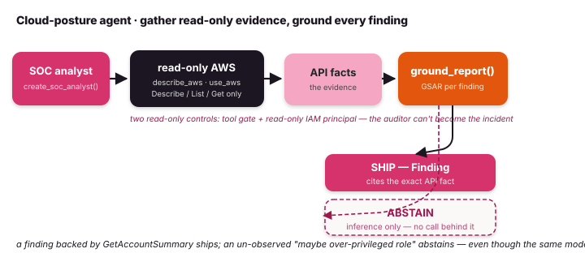

# Cloud-posture agent — grounded, read-only AWS auditing

`create_soc_analyst()` builds a SOC-analyst-shaped agent that audits an AWS
account **read-only** and grounds every finding it proposes against the API
facts it actually observed. It is the worked, end-to-end application of the
[security layer](security.md): the model gathers evidence and proposes
findings; [GSAR grounding](gsar.md) decides which ones ship.

A commodity "AWS agent" will confidently narrate misconfigurations it never
observed. Here an ungrounded claim *cannot* become a `Finding` — it abstains —
so the report is trustworthy by construction, and the agent is read-only by
construction, so the auditor can't become the incident.

{ .diagram }

## Two spec-driven tools

Instead of one hand-written tool per AWS service, the agent gets two generic
tools driven by **botocore's service models** — AWS's canonical API
specification, shipped with `boto3`:

- **`describe_aws(service, operation)`** — introspect the spec. No arguments
  lists every service (the *shape* of AWS — 400+ services); a service lists
  that service's read-only operations; a service + operation lists the
  operation's parameters. This is how the agent discovers what it can call.
- **`use_aws(service, operation, parameters)`** — execute one read-only
  operation and return the raw API response, which becomes the **evidence**
  behind a grounded finding.

```python
from tulip.security import describe_aws, use_aws

describe_aws()                                  # {"services": ["s3", "ec2", ...]}
describe_aws("s3")                              # s3's read-only operations
describe_aws("ec2", "DescribeInstances")        # that operation's parameters
use_aws("iam", "GetAccountSummary")             # → raw response (the evidence)
```

### Read-only by construction

`use_aws` admits an operation only if its name starts with a read verb
(`Describe`, `List`, `Get`, `Lookup`, `Search`, `Select`, `BatchGet`,
`Query`, `Scan`, …) — and it checks **before** any call is made:

```python
use_aws("iam", "CreateUser", {"UserName": "x"})
# PermissionError: refused: iam:CreateUser is not a read-only operation.
```

The tool gate is defense-in-depth; the **hard backstop is the IAM identity**.
Run the agent under a read-only principal (`SecurityAudit` + `ViewOnlyAccess`)
and the cloud itself refuses a write even if the gate were bypassed. Two
independent controls, neither trusting the model.

## The factory

`create_soc_analyst()` is a thin, security-shaped layer over
[`create_deepagent`](deepagent.md): it bakes in the AWS tools, a SOC-analyst
system prompt, a structured `PostureReport` output schema, and
reflexion + grounding.

```python
from tulip.security import create_soc_analyst, SecurityControls

controls = SecurityControls(min_gsar=0.6, min_confidence=0.6)
analyst = create_soc_analyst(
    model="anthropic:claude-sonnet-4-6",
    controls=controls,
    scope="Focus on account-level IAM: root access keys and MFA.",
)

result = analyst.run_sync(
    "Review the account-level IAM posture. Start with iam GetAccountSummary, "
    "cite the exact API facts as evidence, then submit your report."
)
report = result.parsed            # a PostureReport
```

`SecurityControls` is the one bundle the agent and the grounding step share —
the GSAR threshold a finding's evidence must clear, the submission-confidence
floor, and whether the read-only AWS tools are attached. You can add your own
tools (threat-intel, SIEM) alongside the AWS ones via `tools=[...]`.

## The grounding split

The agent submits a `PostureReport` of proposed `PostureFinding`s, each citing
its evidence. `ground_report()` runs each one through GSAR: a finding ships as
a typed `Finding` only if its cited evidence clears the threshold, otherwise it
abstains.

```python
from tulip.security import ground_report, is_finding

for grounded in ground_report(report, controls):
    if is_finding(grounded):
        print("SHIP   ", grounded.severity, grounded.title, grounded.gsar_score)
    else:
        print("ABSTAIN", grounded.reason)
```

Direct API observations become grounded claims; an analyst's *inference*
becomes an ungrounded claim, which cannot on its own admit a finding. So a
finding backed by `GetAccountSummary` ships, while a "there might be an
over-privileged role" with no call behind it abstains — even though the same
model proposed both.

Run live against a real account, this surfaces the genuine CIS-AWS-1.4 issue:

```text
SHIP    critical  Root account has an active access key   gsar=1.00
SHIP    info      Root account MFA is enabled             gsar=1.00
ABSTAIN withheld (replan): grounding below the proceed threshold
```

## Credentials

The tools resolve credentials via boto3's standard chain. The default profile
is `tulip-security-audit` (override with `TULIP_AWS_PROFILE`); the region comes
from `TULIP_AWS_REGION` (default `us-east-1`). Point the profile at a read-only
identity:

```bash
export TULIP_AWS_PROFILE=tulip-security-audit   # SecurityAudit + ViewOnlyAccess
export TULIP_AWS_REGION=us-east-1
```

`boto3` is an optional dependency — install the extra:

```bash
pip install 'tulip-agents[aws]'
```

## Where it shows up

- Notebooks: [grounded cloud-posture agent](../notebooks/notebook_73_cloud_posture_agent.md)
  (Part 1 runs the grounding decision fully offline).
- [Security layer](security.md) — the `ground_finding` primitive this builds on.
- [Threat scenarios](threat-scenarios.md) — the catalogue the findings tag into
  (root-key abuse maps to OWASP ASI03, *Identity & Privilege Abuse*).
- [DeepAgent](deepagent.md) — the agent core the factory wraps.
