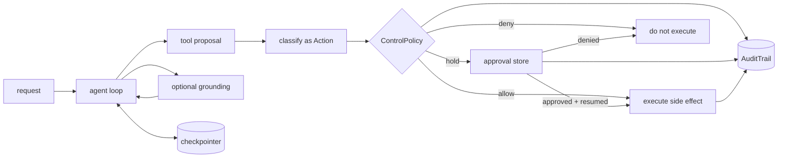

# Control-layer architecture

Tulip separates deciding what to do from deciding whether a consequential
action may execute. This page is the domain-neutral map. `SecurityContext` is
one worked application of the same control primitives.

A hold is `require_human` in the API: `ApprovalDecision.outcome` is
`ApprovalOutcome.REQUIRE_HUMAN`. These pages use the words allow, hold and
deny; the API strings are secondary detail.

## Responsibilities by layer

| Layer | Runtime responsibility | Developer responsibility | Model-dependent part |
|---|---|---|---|
| Agent loop | Runs the think/tool/observe cycle and emits typed events | Set tools, budgets, termination, and provider configuration | Tool choice and generated arguments |
| Grounding | Applies configured thresholds to a typed evidence partition | Enable it, supply relevant evidence, calibrate thresholds, choose fail behavior | Claim extraction and evidence classification |
| Action classification | Carries explicit environment, kind, scope, and tags | Derive complete, accurate labels from the actual call | Avoid using the model as the sole classifier for critical labels |
| Admission | Calls the side effect only on `allow`; returns/raises on hold or deny | Route every consequential path through `admit()` or `gate_tool()` | None in `ControlPolicy` evaluation itself |
| Approval | Persists a pending decision through a configured store | Provide a store that survives a restart (such as `FileApprovals`), an authenticated decision channel, and a resume flow | None required for the store state machine |
| Persistence | Restores supported run state through a checkpointer | Choose and operate a backend with suitable durability and isolation | None |
| Audit | Hash-chains records supplied to an `AuditTrail` | Persist/export the trail and protect its head externally | None |

## The enforcement boundary

`admit(action, perform, ...)` owns one concrete boundary: it does not call
`perform` unless policy returns `allow` (or a previously held call is resumed
with a valid approval). A deny or hold is recorded when a trail is supplied.

That guarantee applies only to the callable passed as `perform`. It does not
discover an alternate direct call elsewhere in your application. Prefer
`gate_tool()` when exposing a side-effecting tool to an agent, keep the
ungated implementation private, and test that every registered mutating tool
is wrapped.

## Failure behavior

| Failure | Behavior to design for |
|---|---|
| Policy returns hold or deny | Side effect is not called; handle the refusal or interrupt explicitly |
| Process stops while held | Resume requires an `ApprovalStore` that survives a restart, such as [`FileApprovals`](../api/control.md#pausing-until-someone-decides), and a checkpointer; `InMemoryApprovals` is for tests and is lost with the process |
| External API succeeds, process stops before local result is recorded | A replay may occur; pass a stable idempotency key to the external API |
| Audit records are changed | `AuditTrail.verify()` detects a broken local chain; protect a durable copy or chain head outside the process |
| Action is mislabeled or a route skips the gate | Policy cannot protect what it cannot see; coverage tests and code review are required |
| Grounding judge is wrong | Typed scores remain an assessment, not a truth oracle; evaluate and calibrate the judge for the deployment |

## Recommended production composition

1. Define a typed tool for the side effect and an argument-derived `Action`.
2. Wrap it with `gate_tool()` and a reviewed `ControlPolicy`.
3. Use an `ApprovalStore` that survives a restart, such as `FileApprovals`, for
   human decisions (see
   [Pausing until someone decides](../api/control.md#pausing-until-someone-decides)).
   `gate_tool(..., on_refusal="interrupt", approval=store)` pauses the run on
   a hold, and `agent.resume(..., thread_id=..., perform_dangling=True)`
   re-issues the held call once a person has decided with `store.decide(...)`.
   `FileApprovals` keeps held calls in one JSON file across a restart but
   serialises writers within one process only; `InMemoryApprovals` does not
   survive a restart. An `ApprovalAuthority` limits which principals may
   decide; authenticating the person named in `by=` is your decision
   channel's job.
4. Use a checkpointer for resumable agent state.
5. Send a stable operation key to the downstream service.
6. Export audit records to durable, access-controlled storage.
7. Test allow, hold, deny, restart, duplicate-call, and crash-recovery paths.

See [First controlled action](../how-to/first-controlled-action.md) for a small
offline run, [policy authoring](policy-authoring.md) for classification
coverage, [`gate_tool`](../api/control.md#tulip.control.gate.gate_tool) for the
interrupt-and-resume parameters, [interrupts](interrupts.md) for
`agent.resume(...)`, and [SecurityContext](security-context.md) for a
security-domain application.
