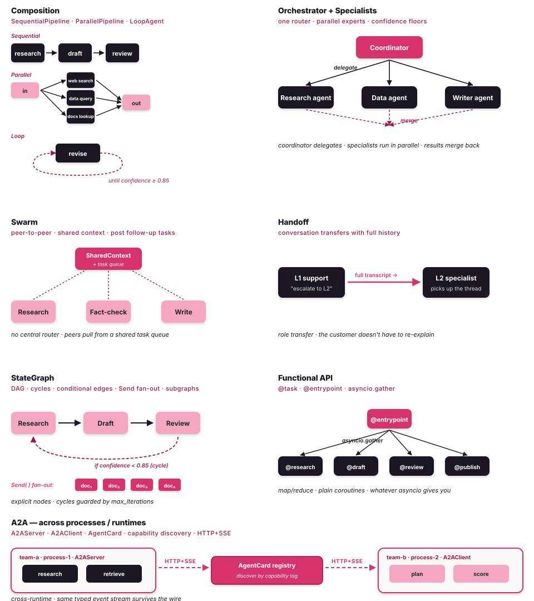

# Multi-agent workflows

Multi-agent workflows are what Tulip is for. Seven shapes you compose
in one process or scale across a mesh, every shape backed by the same
`Agent` class, the same event stream, and the same primitives. Pick a
shape directly, or let the **cognitive router** select and
compile the right one from a natural-language task description.



!!! tip "Don't know which shape to use?"
    [PRISM — the cognitive router](router.md) extracts a typed
    `GoalFrame` from your task and selects a matching protocol from a
    typed registry. Eight built-in protocols, zero topology hand-writing.

## What you can ship today

Every example below is a real `examples/notebook_NN_*.py` file in the
repo, runs end-to-end against the bundled `MockModel` (no creds), and
upgrades to a live provider by setting one env var.

| | Workflow | One line | Code |
|---|---|---|---|
| **41** | DeepAgent — research factory | `create_deepagent` with reflexion + grounding + subagent dispatch + `deepagent.*` SSE events. | [`notebook_29_deepagent.py`](https://github.com/tuliplabs-ai/sdk-python/blob/main/examples/notebook_29_deepagent.py) |
| **42** | Map-reduce code review | Scatter a diff to `N` reviewers via `Send`, reduce findings into one report. | [`notebook_30_map_reduce_code_review.py`](https://github.com/tuliplabs-ai/sdk-python/blob/main/examples/notebook_30_map_reduce_code_review.py) |
| **43** | Supervisor + critic loop | Recon → Report author → Skeptical reviewer, loop back to the author until the reviewer approves (cap'd revisions). | [`notebook_31_supervisor_critic_loop.py`](https://github.com/tuliplabs-ai/sdk-python/blob/main/examples/notebook_31_supervisor_critic_loop.py) |
| **44** | Adversarial debate + judge | One agent argues the finding is a true positive, another argues benign, across N rounds; Judge emits a typed `Verdict` via `output_schema`. | [`notebook_32_debate_with_judge.py`](https://github.com/tuliplabs-ai/sdk-python/blob/main/examples/notebook_32_debate_with_judge.py) |
| **45** | Multi-agent + human-in-the-loop | Three patterns in one file: approval gate, human-as-tool, long-pause snapshot/resume. | [`notebook_33_multiagent_human_in_loop.py`](https://github.com/tuliplabs-ai/sdk-python/blob/main/examples/notebook_33_multiagent_human_in_loop.py) |
| **46** | IR war-room | Triage → 3 parallel investigators (SIEM / EDR / threat intel) → severity gate → page-the-responder → contain → typed `Postmortem`. | [`notebook_63_incident_response.py`](https://github.com/tuliplabs-ai/sdk-python/blob/main/examples/notebook_63_incident_response.py) |
| **47** | Vendor security review | Questionnaire analyst → Posture analyst → risk-tier router (auto / security-manager / +GRC / +CISO) → typed `VendorDecision`. Stacked `interrupt()` gates on the top tiers. | [`notebook_64_procurement_approval.py`](https://github.com/tuliplabs-ai/sdk-python/blob/main/examples/notebook_64_procurement_approval.py) |
| **48** | DPA & security-addendum review | Parser → 3 parallel reviewers (privacy / security / compliance) → revision gate → human analyst → `Command(goto="sign_off")` short-circuits when resolved. Cycles enabled. | [`notebook_65_contract_review.py`](https://github.com/tuliplabs-ai/sdk-python/blob/main/examples/notebook_65_contract_review.py) |

## Pick a shape

Three questions get you to the right shape almost every time:

1. **Do agents need to talk across processes or runtimes?** If yes, you
   want **A2A**. If no, everything else lives in one Python process.
2. **Does the flow have cycles or conditional routing?** If yes, you
   want **StateGraph**. If it's a straight chain or fan-out, you want
   **Composition**.
3. **Do you want one coordinator picking the next agent, or peers
   collaborating without a central router?** Coordinator →
   **Orchestrator + Specialists**. Peers → **Swarm**. A single agent
   passes the conversation onward → **Handoff**.

The decision tree below is the same questions in diagram form.

```text
                ┌── do agents need to talk across processes / runtimes? ──┐
                │                                                         │
              yes ──→  A2A                                                no
                                                                          │
                  ┌─── need explicit control flow? ───┐
                  │                                   │
                yes                                   no
                  │                                   │
        ┌─────────┴───────────┐         ┌─────────────┴────────────┐
        │                     │         │                          │
   linear / fan-out       cycles?     central router?         no router
   no cycles               yes          yes                     │
        │                  │            │                       │
   Composition         StateGraph   Orchestrator + Specialists   Swarm
                                                                  │
                                                              one agent
                                                              hands off?
                                                                  │
                                                             yes  │  no
                                                                Handoff
```

Writing your own glue (asyncio fan-out, retries, schedulers)? Use the
**Functional API** (`@task`, `@entrypoint`) — a thin wrapper that brings
agent runs into the ordinary asyncio universe.

## The seven shapes

| Pattern | Best for | Key class | Source |
|---|---|---|---|
| **[Composition](multi-agent/composition.md)** | linear chains; fan-out + merge; revise-until-confidence | `SequentialPipeline`, `ParallelPipeline`, `LoopAgent` | [`agent/composition.py`](https://github.com/tuliplabs-ai/sdk-python/blob/main/src/tulip/agent/composition.py) |
| **[Orchestrator + Specialists](multi-agent/orchestrator.md)** | one router decides which expert handles each sub-task | `Orchestrator`, `Specialist` | [`multiagent/orchestrator.py`](https://github.com/tuliplabs-ai/sdk-python/blob/main/src/tulip/multiagent/orchestrator.py) |
| **[Swarm](multi-agent/swarm.md)** | open-ended research; peer-to-peer; shared context | `Swarm`, `SharedContext` | [`multiagent/swarm.py`](https://github.com/tuliplabs-ai/sdk-python/blob/main/src/tulip/multiagent/swarm.py) |
| **[Handoff](multi-agent/handoff.md)** | escalation desks; investigation moves with a findings + progress summary | `Handoff`, `HandoffAgent`, `create_handoff_manager` | [`multiagent/handoff.py`](https://github.com/tuliplabs-ai/sdk-python/blob/main/src/tulip/multiagent/handoff.py) |
| **[StateGraph](multi-agent/graph.md)** | explicit DAG with cycles, conditional edges, subgraphs | `StateGraph`, `Node`, `Edge` | [`multiagent/graph.py`](https://github.com/tuliplabs-ai/sdk-python/blob/main/src/tulip/multiagent/graph.py) |
| **[Functional](multi-agent/functional.md)** | map/reduce over agents; asyncio-native composition | `@task`, `@entrypoint` | [`multiagent/functional.py`](https://github.com/tuliplabs-ai/sdk-python/blob/main/src/tulip/multiagent/functional.py) |
| **[A2A](multi-agent/a2a.md)** | cross-process / cross-runtime; capability discovery | `A2AServer`, `A2AClient`, `AgentCard` | [`a2a/protocol.py`](https://github.com/tuliplabs-ai/sdk-python/blob/main/src/tulip/a2a/protocol.py) |

## Workflow primitives

The pieces every shape is built from. Drop them into any graph node.

### `Send` — scatter / map-reduce

```python
from tulip.core.send import Send
async def split(state):
    return [Send("worker", {"task": t}) for t in state["tasks"]]
```

Returning a list of `Send` from a node spawns parallel executions —
no `asyncio.gather`, no shared mutable state. Each result lands in
`state[send.send_id]` keyed by the send id.

### `interrupt()` — pause for a human

```python
from tulip.core import interrupt

async def approval_node(state):
    response = interrupt({"question": "Ship it?", "options": ["yes", "no"]})
    return {"approved": response == "yes"}
```

`interrupt()` raises `InterruptException`; the graph catches it,
snapshots state, and returns control to the caller. Resume by calling
`graph.execute(Command(resume="yes"))`.

### `Command(goto=...)` — explicit routing

```python
from tulip.core import goto

async def smart_router(state):
    if state["urgent"]:
        return goto("emergency", priority=10)   # skip ahead
    return {"score": compute_score(state)}      # normal flow
```

Return a `Command` from a node to override the default edge — useful
for short-circuiting refinement loops or skipping straight to sign-off.
Used to skip the revision loop when the analyst says RESOLVED.

### `Agent(output_schema=...)` — typed terminal artifacts

```python
from pydantic import BaseModel
from tulip.agent import Agent, AgentConfig
class Verdict(BaseModel):
    disposition: str   # "true_positive" | "benign"
    confidence: float
    reasoning: str

agent = Agent(config=AgentConfig(model="anthropic:claude-sonnet-4-6", output_schema=Verdict))
result = agent.run_sync("...")
verdict: Verdict = result.parsed   # validated Pydantic instance, not free text
```

When you need a typed artifact at the workflow boundary — `Verdict`,
`Postmortem`, `PurchaseOrder`, `ContractDecision` — `output_schema`
gives you a validated Pydantic instance.

### `GraphConfig(allow_cycles=True)` — refinement loops

```python
from tulip.multiagent.graph import GraphConfig, StateGraph
graph = StateGraph(config=GraphConfig(allow_cycles=True, max_iterations=20))
graph.add_edge("critic", "writer")   # loop edge — only legal with allow_cycles
```

Cycles are off by default (so you can't accidentally infinite-loop).
Opt in with `allow_cycles=True` plus an iteration cap.

## Why these workflows ship to prod

The boring stuff that turns a demo into a product. Every primitive
below works in any of the seven shapes — you don't pick "shape" or
"production-ready", you get both.

### Reflexion — catch a bad turn before the next one

```python
agent = Agent(config=AgentConfig(model=..., reflexion=True))
```

`reflexion=True` self-evaluates every turn and feeds the next Think a
sharper plan. → [Reasoning concept](reasoning.md)

### Grounding — verify claims against their source

```python
agent = Agent(config=AgentConfig(model=..., grounding=True))
```

Each claim is scored against the tool result it came from; below-threshold
claims get dropped or sent back. → [Reasoning concept](reasoning.md) ·
[GSAR](gsar.md) for typed grounding.

### Idempotent tools — side effects fire once

```python
@tool(idempotent=True)
def isolate_host(host_id: str, case_id: str) -> dict:
    return edr.quarantine(host_id, case_id)
```

The ReAct loop dedupes repeat calls on the `(name, kwargs)` hash — the
model can't double-isolate a host, double-page, or re-fire a containment
action. → [Idempotency concept](idempotency.md).

### Checkpointing — survive every restart

```python
agent = Agent(config=AgentConfig(
    model=...,
    checkpointer=S3Backend(bucket="...", prefix="..."),
))
```

Eight backends — one Protocol — and the graph snapshots state at every
interrupt boundary. Pause for a human Friday afternoon, resume Monday
morning from a different process. → [Checkpointers](checkpointers.md).

### Streaming events — every node visible

```python
async for event in graph.stream(initial, mode=StreamMode.NODES):
    match event:
        case StreamEvent(node_id=n, mode=StreamMode.NODES):
            print(f"✓ {n}")
```

Every shape in this section emits the same typed events. SSE-ready,
match-statement friendly, attributable to the specific specialist that
produced them. → [Streaming](streaming.md).

## One event stream across all of them

All seven patterns plus A2A share the same typed event
taxonomy. Consume directly from the generator, or use the opt-in
`EventBus` to get per-component SSE events (`agent.think`,
`agent.tool.started`, `multiagent.orchestrator.routing`, etc.)
from every layer simultaneously:

```python
from tulip.observability import run_context, get_event_bus

async with run_context() as rid:
    result = await orchestrator.execute("Investigate the phishing campaign against finance.")

    async for ev in get_event_bus().subscribe(rid):
        match ev.event_type:
            case "multiagent.orchestrator.decision":
                print("incident commander →", ev.data["specialists_selected"])
            case "agent.tool.started":
                print("  🔧", ev.data["tool_name"])
            case "agent.terminate":
                print("  ✓", ev.data["final_message_preview"])
```

`agent_name` is set on every event so you can attribute output to the
specialist that produced it. SSE streams from `AgentServer` carry the
same shape — your front-end consumer is unchanged whether the back-end
is a single agent, an orchestrator, a swarm, or an A2A mesh.

→ [Observability — EventBus & SSE](observability.md) ·
[SSE event catalogue](sse-events.md)

## Mixing shapes

Nothing stops you running a `Swarm` whose members are themselves
`Orchestrator`s, with a `StateGraph` wrapping the whole thing for
retry policy. The patterns compose; pick the shape that fits each
layer of the problem.

## See also

- [Agent Loop](agent-loop.md) — the loop every agent in every shape runs.
- [Hooks](hooks.md) — observe and steer across all of them.
- [Streaming](streaming.md) — the typed event taxonomy.
