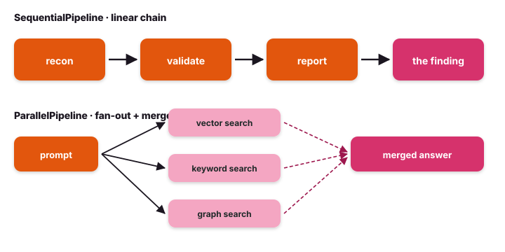

# Composition — pipelines

The composition primitives are for flows you can write as a regular
function: do A, then B, then C — with optional fan-out and merge.

{ .diagram }

## What it is

Three `BaseModel`-shaped pipeline classes, all wrapping a list of
agents (or other pipelines):

| Class | Shape |
|---|---|
| `SequentialPipeline(agents=[...])` | output of agent N feeds agent N+1 |
| `ParallelPipeline(agents=[...])` | one input fans out to all N agents; results merge |
| `LoopAgent(agent=..., max_loops=N)` | run one agent repeatedly until a condition holds or N is hit |

Each composes an `Agent` and walks like one — an async `.run`
returning a `PipelineResult`, the same event stream.

## When to use it

- ✅ The flow is **describable as a function** — "do A, then B, then C".
- ✅ Fan-out is **symmetric** — all branches do similar work on the same
  input (e.g., enrich one indicator across SIEM, EDR, and threat intel).
- ✅ The flow is an **incident triage chain** — recon → enrich → validate →
  report, each step feeding the next.
- ✅ You need **revise-until-confidence** — wrap the finding writer in a
  `LoopAgent` until the abstention clears.
- ✅ You don't need cycles, conditional branches, or per-node retry policies.

## When NOT to use it

- ❌ You need **cycles** that depend on state — use [StateGraph](graph.md).
- ❌ A central agent should **decide which expert runs** — use [Orchestrator](orchestrator.md).
- ❌ The branches need to **talk to each other** — use [Swarm](swarm.md).

## Code

```python
from tulip.agent.composition import (
    SequentialPipeline, ParallelPipeline, LoopAgent,
)

# Sequential: recon → enrich → validate → report
pipeline = SequentialPipeline(agents=[
    recon,
    enrich,
    validate,
    report,
])

result = await pipeline.run("Triage the attack surface on 192.0.2.10.")
```

```python
# Parallel: enrich one indicator across SIEM, EDR, and threat intel
parallel = ParallelPipeline(agents=[
    siem_query,
    edr_timeline,
    threat_intel,
])
enrichment = await parallel.run(
    "Enrich 198.51.100.7: in our SIEM? EDR matches? known-bad campaigns?"
)

# Loop: revise the finding until the abstention clears, max 5 loops
revise = LoopAgent(agent=reviser_agent, max_loops=5)
final = await revise.run(initial_finding)
```

```python
# Compose nested — Sequential of (Parallel + LoopAgent)
end_to_end = SequentialPipeline(agents=[
    ParallelPipeline(agents=[recon, validate]),
    enrich,
    LoopAgent(agent=reviser, max_loops=5),
])
result = await end_to_end.run("Triage the attack surface on 192.0.2.10.")
```

## Notebooks

- [`notebook_21_composition.py`](https://github.com/tuliplabs-ai/sdk-python/blob/main/examples/notebook_21_composition.py)
  — `SequentialPipeline`, `ParallelPipeline`, `LoopAgent`.
- [`notebook_30_map_reduce_code_review.py`](https://github.com/tuliplabs-ai/sdk-python/blob/main/examples/notebook_30_map_reduce_code_review.py)
  — same fan-out shape with `Send` inside a graph (use this when you
  need state-aware fan-out beyond what `ParallelPipeline` gives you).
- [`notebook_31_supervisor_critic_loop.py`](https://github.com/tuliplabs-ai/sdk-python/blob/main/examples/notebook_31_supervisor_critic_loop.py)
  — `LoopAgent`-style refine-until-confidence written as a graph
  (the cycle version when you also need conditional edges).

## Source

[`agent/composition.py`](https://github.com/tuliplabs-ai/sdk-python/blob/main/src/tulip/agent/composition.py)
— `SequentialPipeline`, `ParallelPipeline`, `LoopAgent`.

## See also

- [Multi-agent overview](../multi-agent.md) — all seven coordination patterns plus A2A.
- [StateGraph](graph.md) — when you need cycles or conditional branches.
- [Functional](functional.md) — when you'd rather use plain asyncio.gather.
