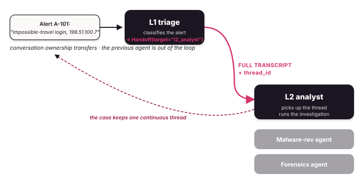

# Handoff

Handoff is what a SOC escalation desk does. One agent owns the
investigation, decides it needs a different tier, and hands the
**whole transcript** to the next agent — who picks up where it left
off.

{ .diagram }

## What it is

A `Handoff` flow has:

- An **`initial`** agent — the entry point (usually L1 triage).
- A **`targets`** dict — name → agent for each possible next tier.

The initial agent ends a turn with a `Handoff(target="tier2")`
directive. The full message history transfers; the L2 analyst
reads it as if it were the next turn of the same investigation.
State, checkpointer, and `thread_id` survive.

## When to use it

- ✅ **SOC tier escalation (L1 → L2 → L3)** where the investigation
  is the unit of work.
- ✅ **"Pass to a human"** — the on-call responder simply replaces
  one of the targets.
- ✅ **Escalation** when the first analyst realises it's above their
  tier (after a few turns of triage, not on first read).
- ✅ The investigation should **carry full context** so the next
  tier doesn't re-triage from scratch when control transfers.

## When NOT to use it

- ❌ The coordinator delegates a **sub-task** and waits for the
  answer (the conversation belongs to the coordinator) — use
  [Orchestrator](orchestrator.md) instead.
- ❌ Multiple agents should **process the conversation in parallel**
  — use [Composition](composition.md) or [Swarm](swarm.md).
- ❌ The flow is **fully scripted** — handoff is for cases where
  the routing emerges from the conversation.

## Difference vs Orchestrator

| | Handoff | Orchestrator |
|---|---|---|
| Investigation owner | **moves** between agents | stays with the coordinator |
| Routing decision | the agent that's currently in charge | always the coordinator |
| Specialist's view of history | full transcript | just the sub-task they were dispatched for |
| Drives the live investigation? | usually yes | usually no |

## Code

```python
from tulip.multiagent import Handoff

triage = Agent(
    model="anthropic:claude-sonnet-4-6",
    tools=[query_siem, enrich_indicator],
    system_prompt=(
        "You are L1 SOC triage on incoming alerts. "
        "Decide whether this is a malware, phishing, or intrusion case. "
        "Then call Handoff(target=...)."
    ),
)
malware = Agent(
    model="anthropic:claude-sonnet-4-6",
    tools=[lookup_hash, isolate_host],
    system_prompt="You are an L2 malware analyst handling escalations.",
)
phishing = Agent(
    model="anthropic:claude-sonnet-4-6",
    tools=[enrich_indicator, query_siem],
    system_prompt="You are an L2 analyst handling phishing reports.",
)
intrusion = Agent(
    model="anthropic:claude-sonnet-4-6",
    tools=[isolate_host],
    system_prompt="You are an L3 incident responder handling intrusions.",
)

flow = Handoff(
    initial=triage,
    targets={"malware": malware, "phishing": phishing, "intrusion": intrusion},
)

result = flow.run_sync(
    "EDR alert: suspicious process on host 192.0.2.45 dropping an unknown binary.",
    thread_id="alert-a42-2026-04",
)
```

## What persists across the handoff

- `state.messages` — the full investigation history.
- `state.tool_executions` — including idempotency hashes, so the
  next tier won't re-fire a containment action the previous tier already ran.
- `state.metadata` — your application's per-investigation data.
- `thread_id` — same thread, just a different tier driving.

The receiving agent picks up the same loop. It does not see the
handoff as a "new turn"; it sees the previous transcript and the
last triage note.

## Notebooks

- [`notebook_25_agent_handoff.py`](https://github.com/tuliplabs-ai/sdk-python/blob/main/examples/notebook_25_agent_handoff.py)
  — full L1 triage + malware + phishing + intrusion escalation flow.
- [`notebook_33_multiagent_human_in_loop.py`](https://github.com/tuliplabs-ai/sdk-python/blob/main/examples/notebook_33_multiagent_human_in_loop.py)
  — handoff to a human via `interrupt()` (one of three HITL patterns
  in the same file).

## Source

[`multiagent/handoff.py`](https://github.com/tuliplabs-ai/sdk-python/blob/main/src/tulip/multiagent/handoff.py).

## See also

- [Conversation Management](../conversation-management.md) — how the
  thread is checkpointed across the handoff.
- [Multi-agent overview](../multi-agent.md) — pick a shape.
