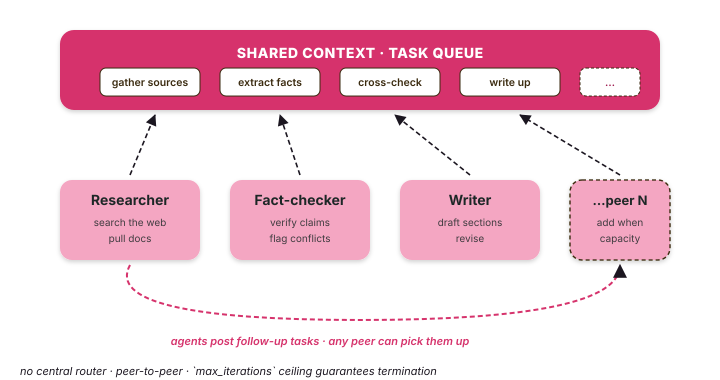

# Swarm

A swarm is a peer-to-peer task pool. Agents pull tasks off a shared
queue, run them, and may post follow-up tasks for any peer to pick up.
**Nobody is in charge.**

{ .diagram }

## What it is

Three pieces:

- A **`SharedContext`** — a typed blackboard (findings, messages, and
  task results) every agent reads and writes.
- A **task queue** — agents pull from it; `add_task` (and task
  decomposition) push to it.
- N **`SwarmAgent`s** — each with its own `capabilities` tags and
  system prompt.

Each iteration, every available agent picks the next task it's
qualified for, runs it, and may emit follow-up tasks. The swarm
exits when the queue empties or `max_iterations` is hit.

## When to use it

- ✅ **Open-ended research** — no fixed plan; whatever an agent finds
  may spawn new sub-tasks.
- ✅ **Heterogeneous specialists** — each agent has different tools
  but any of them can pick up the next task they're qualified for.
- ✅ **Long-running batch** — a queue depth + a max-iteration budget
  is the natural shape.
- ✅ **No single coordinator should exist** — peer-to-peer is the
  point.

## When NOT to use it

- ❌ The flow is actually **linear** → use [Composition](composition.md).
- ❌ One agent should **decide** who runs → use [Orchestrator](orchestrator.md).
- ❌ The **conversation transcript** should follow one role to another → use [Handoff](handoff.md).
- ❌ You need **strict execution order** — swarms run agents concurrently
  by design.

## Code

```python
import asyncio
from tulip.multiagent import create_swarm, create_swarm_agent


async def main():
    model = "anthropic:claude-sonnet-4-6"

    scout = create_swarm_agent(
        name="Scout",
        capabilities=["search", "collect", "investigate"],
        system_prompt="You are a research scout. Find sources, pull data, scope leads.",
    )
    analyst = create_swarm_agent(
        name="Analyst",
        capabilities=["analyze", "verify", "compare"],
        system_prompt="You are an analyst. Verify claims, cross-check sources, quantify findings.",
    )
    writer = create_swarm_agent(
        name="Writer",
        capabilities=["write", "summarize", "document"],
        system_prompt="You are a writer. Take confirmed findings, draft the report.",
    )

    swarm = create_swarm(
        name="Research swarm",
        agents=[scout, analyst, writer],
        model=model,
    )
    swarm.max_iterations = 12

    result = await swarm.execute(
        initial_task="Research why checkout conversion dropped last week: collect data, verify causes, draft a report.",
    )
    print(result.summary)
    for task in result.completed_tasks:
        print(task.description, "→", task.status)


asyncio.run(main())
```

A `SwarmAgent` carries free-form `capabilities` tags (not a tool list);
tasks are matched to agents by those tags. `execute()` is async and
returns a `SwarmResult` with `completed_tasks`, `failed_tasks`, a shared
`context`, and a `summary`. The same shape runs an incident-response
(IR) war room — a hunter, a forensics analyst, and a reporter pulling
from one queue.

## How tasks enter the queue

You can seed the queue directly with `add_task(...)` (higher `priority`
runs first), and `execute(decompose_tasks=True)` will also break the
initial task into capability-matched sub-tasks:

```python
swarm = create_swarm(name="Research swarm", agents=[scout, analyst, writer], model=model)

swarm.add_task("Pull last week's conversion-funnel metrics", priority=10)
swarm.add_task("Draft the stakeholder status update", priority=3)

result = await swarm.execute()
```

Each iteration, any qualifying agent claims the next task it's eligible
for and works it, recording findings on the shared `context`.

## Termination

Swarms stop when:

- The queue empties **and** no agent emits new tasks, OR
- `max_iterations` is hit.

## Notebook

[`notebook_24_swarm_multiagent.py`](https://github.com/tuliplabs-ai/sdk-python/blob/main/examples/notebook_24_swarm_multiagent.py)
— a three-agent research swarm with shared context.

## Source

[`multiagent/swarm.py`](https://github.com/tuliplabs-ai/sdk-python/blob/main/src/tulip/multiagent/swarm.py)
— `Swarm`, `SharedContext`.

## See also

- [Multi-agent overview](../multi-agent.md) — pick a shape.
- [Orchestrator](orchestrator.md) — when you DO want a router.
- [Termination](../termination.md) — composable stop conditions.
