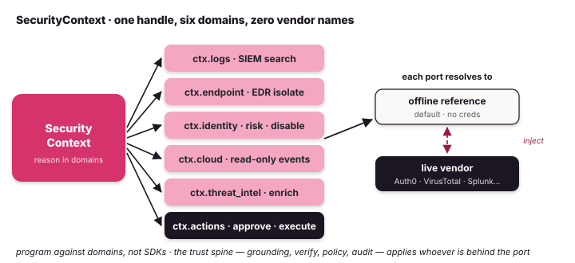

# SecurityContext

**In plain terms:** an incident responder doesn't think *"I'll query Splunk, then
CrowdStrike, then Okta."* They think *"I'm investigating an incident"* — pull the
logs, check the user, enrich the indicator, look at the host. `SecurityContext` is
that mental model in code: **one handle over the security domains**. Your agent
reasons in *domains* — logs, identity, endpoint, threat-intel, cloud, actions —
and never hard-codes a vendor SDK. Point it at your real stack by injecting a
provider; the investigation code doesn't change.

{ .diagram }

```python
from tulip.security import SecurityContext

ctx = SecurityContext()                              # zero config — runs offline
await ctx.logs.search("failed login spike", window="6h")
await ctx.identity.risk("mallory@example.com")
await ctx.threat_intel.enrich("198.51.100.23")
await ctx.endpoint.get_host("WS-0142")
```

## The domains

Each domain is a small `Protocol` — a *port* — that a provider implements. The
handle is the same whether the provider is the offline reference or a live vendor.

| Handle | Domain | Methods |
|---|---|---|
| `ctx.logs` | SIEM / log search | `search(query, window="24h")` |
| `ctx.endpoint` | EDR host forensics + containment | `get_host`, `detections`, `isolate` |
| `ctx.identity` | identity provider (the surface most attacks touch) | `get_user`, `risk`, `signins`, `disable` |
| `ctx.cloud` | cloud control-plane evidence (read-only) | `describe`, `events` |
| `ctx.threat_intel` | IOC reputation / enrichment | `enrich` |
| `ctx.actions` | decide on **and run** a response action | `request_approval(action, finding=…, verdict=…)` · `execute(action, perform, finding=…, verdict=…)` |

Reads are plain domain calls. **Writes** — `endpoint.isolate`, `identity.disable` —
model real-world actions: run them through the [admission gate](#admission-control-the-enforcement-point) so they fire only after the chain clears.

!!! note "Writes are simulated today"
    In the current build the bundled reference adapters **and** the vendor
    templates (Entra/Okta/Auth0 `disable`, CrowdStrike `isolate`) return a
    **simulated offline-sample receipt** — they record the decision but do
    **not** lock an account out or quarantine a host. Wire and verify the live
    vendor write path before treating these as enforcement.

## Zero-config by default

Every domain defaults to a bundled **offline reference adapter**, so
`SecurityContext()` works with no credentials, no network, and no vendor account.
The reference identity provider, for instance, returns two deterministic users —
a low-risk `jsmith@example.com` and a high-risk `mallory@example.com` with
impossible-travel sign-ins — so examples, tests, and CI all run the same code path
they would in production, just against benign data.

This matters for adoption: you can write and unit-test an entire investigation
offline, then flip individual domains to live vendors one at a time.

## Going live — inject a provider

Live vendors live in the one-way-dependent
[`tulip-integrations`](https://github.com/tuliplabs-ai/tulip-integrations) package.
Core never imports a vendor; you wire them explicitly:

```python
from tulip.security import SecurityContext
from tulip_integrations.identity.auth0 import Auth0Identity
from tulip_integrations.threat_intel.virustotal import VirusTotalIntel

# Identity + threat-intel go live; logs/endpoint/cloud stay on the offline reference.
ctx = SecurityContext(identity=Auth0Identity(), threat_intel=VirusTotalIntel())
```

Each provider resolves its credentials from the environment and **falls back to the
offline sample** when none are present — so the same code is safe to run in CI.

| Domain | Provider | Vendor | Status |
|---|---|---|---|
| `identity` | `tulip_integrations.identity.auth0.Auth0Identity` | Auth0 | **live-verified** |
| `identity` | `tulip_integrations.identity.okta.OktaIdentity` | Okta | reference template |
| `threat_intel` | `tulip_integrations.threat_intel.virustotal.VirusTotalIntel` | VirusTotal | **live-verified** |
| `endpoint` | `tulip_integrations.edr.crowdstrike.CrowdStrikeEndpoint` | CrowdStrike | reference template |
| `logs` | `tulip_integrations.siem.splunk.SplunkLogs` | Splunk | reference template |
| `cloud` | core `tulip.security.aws` (`pip install tulip-agents[aws]`) | AWS | in core |

A provider is just a class that satisfies the domain port. Writing your own is
the same shape as the bundled ones — see
[Adding an integration](https://github.com/tuliplabs-ai/tulip-integrations/blob/main/CONTRIBUTING.md).

## A full investigation — grounded, verified, gated

The facade earns its place in the *whole loop*, not in any one call. An AI agent
that merely reads telemetry is a chatbot; the moment it can **act**, three things
have to be true — the data is real, the claim is verified, and the action is
gated. `SecurityContext` puts the trust spine right in the path:

```python
from tulip.control import Action
from tulip.security import Evidence, SecurityContext, Severity, verify
from tulip_integrations.identity.auth0 import Auth0Identity

# Real identity provider. ctx.actions defaults to ControlPolicy(), which sends
# production account-disables to a human.
ctx = SecurityContext(identity=Auth0Identity())

# 1. INVESTIGATE — by domain, against the real Auth0 tenant.
risk = await ctx.identity.risk("mallory@corp.com")
# -> {'user': ..., 'risk': 'high', 'impossible_travel': True}

# 2. FORM A FINDING, then VERIFY it. An independent skeptic challenges the
#    evidence and re-scores confidence — a thin claim is refuted, not acted on.
finding = Evidence(
    title="Account compromise: impossible-travel sign-ins",
    description="High-risk Auth0 user with impossible travel between two sign-ins.",
    severity=Severity.HIGH,
    evidence_refs=["auth0:logs:mallory@corp.com"],
    gsar_score=0.86,
)
verdict = await verify(finding)
if not verdict.survives:
    return  # abstain — no hallucinated containment

# 3. PROPOSE CONTAINMENT — gated by policy through ctx.actions.
decision = ctx.actions.request_approval(
    Action(name="disable_user", asset="mallory@corp.com", environment="production"),
    finding=finding,
    verdict=verdict,
)
# decision.outcome -> "require_human": a person decides, with the evidence
# and the verdict attached. The agent never disables a prod account on its own.

# 4. ON APPROVAL, ACT. NB: in the current build `disable` returns a simulated
#    offline-sample receipt — it does not yet lock the account out.
if decision.allowed:
    await ctx.identity.disable("mallory@corp.com")
```

> **One investigation, six domains, zero vendor names** in the logic. Swap
> `Auth0Identity` for `OktaIdentity`, or `VirusTotalIntel` for another feed, and
> steps 1–4 are untouched. That is the platform bet: program against domains, and
> the trust spine — [grounding](gsar.md), verification, policy, and a hash-chained
> audit trail — applies no matter whose API is behind the port.

The gate in step 3 is a `ControlPolicy`: `require_human_for={"production"}` by
default, alongside `require_verification_score`, `max_blast_radius`, `deny_for`,
and `min_severity`. To enforce a custom policy, call `approve(action, policy=…,
finding=…, verdict=…)` directly — `ctx.actions.request_approval` is the
convenience wrapper around it.

`verify()` is framework-agnostic by design: it accepts a Tulip `Evidence` **or a
finding-shaped dict** produced by any other agent (LangGraph, CrewAI, anything),
which is what lets Tulip sit *above* the stack as the verification layer rather
than competing with the frameworks below it.

## Admission control — the enforcement point

`request_approval()` returns a *decision*; it doesn't run anything. To make the
decision binding, run the action through the **admission gate** — `admit()`, or
`ctx.actions.execute()` on the facade. The side effect fires **only if** the
chain clears (`approve()` → ALLOW); otherwise it raises `AdmissionError`, and the
attempt is recorded to the audit trail either way:

```python
from tulip.control import Action, AdmissionError, verify

verdict = await verify(finding)
try:
    await ctx.actions.execute(
        Action(name="disable_user", asset="mallory@corp.com", environment="production"),
        lambda: ctx.identity.disable("mallory@corp.com"),   # the side effect
        finding=finding,
        verdict=verdict,
    )
except AdmissionError as exc:
    route_to_human(exc.decision)   # production → require_human, so the disable never fired
```

This is what turns the chain from *advisory* into *enforced*: there is no path
through `execute()` to a side effect that skips evidence, verification, and
policy — and nothing reaches production without leaving an audit record. It's the
admission-controller pattern (think Kubernetes admission webhooks) applied to
agent actions, and it's what makes Tulip a *runtime* rather than a library of
trust functions.

## From facade to agent — `ctx.toolset()`

The domain handles are the *programmatic* facade — what your own code calls. When
you want an autonomous `tulip.Agent` to drive the investigation, hand it the
*agent* facade instead:

```python
from tulip import Agent

agent = Agent(model="anthropic:claude-sonnet-4-6", tools=ctx.toolset())
```

`toolset()` returns the deduplicated, agent-ready security tool bundle, so the same
domain capabilities are available to the model as callable tools.

## The one-way dependency

Core (`tulip-agents`) defines the ports and ships the offline reference providers;
it **never imports a vendor**. Vendors live in `tulip-integrations`, which depends
on core — the LangChain-community → langchain-core relationship. You inject
providers explicitly, so there is no hidden vendor coupling and the offline path is
always intact.

See also: [Agentic AI-security](agentic-ai-security.md) ·
[Grounded findings](security.md) · [GSAR typed grounding](gsar.md) ·
[Threat scenarios](threat-scenarios.md) · [Cloud-posture agent](cloud-posture.md).
