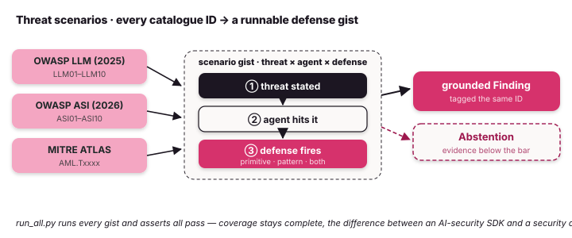

# Threat scenarios — the coverage matrix

Tulip encodes three published threat catalogues as typed enums in
[`tulip.security.taxonomy`](security.md#threat-taxonomy): the **OWASP Top 10
for LLM Applications (2025)**, the **OWASP Top 10 for Agentic Applications
(2026)**, and **MITRE ATLAS**. For each item there is a small, standalone
**scenario gist** — it states one threat, shows an agent hitting it, and shows
the Tulip defense stopping it. This page is the security-domain application of
the same general policy/audit machinery every Tulip agent uses — the catalogues
just name the threats. (For developers outside security: OWASP publishes
community-standard top-10 risk lists for web and AI applications; MITRE ATLAS
catalogues real-world attack techniques against AI systems.)

{ .diagram }

Every gist is **runnable offline with no credentials**. Together they map
*every* ID encoded in Tulip's three taxonomy enums (`OwaspLLM`, `OwaspASI`,
and `AtlasTechnique`) to at least one runnable example, and a single runner
keeps that mapping honest. The OWASP LLM/ASI enums encode their full
published top-10s; `AtlasTechnique` encodes a representative subset of MITRE
ATLAS:

```bash
# in a checkout of tuliplabs-ai/tulip-agents
python examples/scenarios/run_all.py          # run every gist, assert all pass
python examples/scenarios/prompt_injection.py  # or run one
```

A scenario's defense is one of three kinds:

- **primitive** — a built-in SDK control: `is_safe_url` / `safe_resolve`,
  [`GuardrailsHook`](safety.md#guardrails-block-dangerous-tools-and-redact-pii),
  [`ground_finding` / `ground_fingerprint`](security.md);
- **pattern** — an allowlist or audit pattern with SDK taxonomy + wiring
  points, where there is no single built-in;
- **both**, where they stack.

This is the difference between a control runtime and an agent framework with a
security demo: the catalogue is *complete* and the runner *proves* it stays
that way.

## OWASP LLM Top 10 (2025)

| ID | Risk | Gist | Defense |
|----|------|------|---------|
| LLM01 | Prompt Injection | [`prompt_injection.py`][pi] | `GuardrailsHook` content patterns (primitive) |
| LLM02 | Sensitive Information Disclosure | [`sensitive_disclosure.py`][sd] | `GuardrailsHook` PII redaction (primitive) |
| LLM03 | Supply Chain | [`supply_chain.py`][sc] | provenance allowlist (pattern) |
| LLM04 | Data & Model Poisoning | [`memory_poisoning.py`][mp] | `ground_finding` abstention (primitive) |
| LLM05 | Improper Output Handling | [`improper_output_handling.py`][ioh] | `GuardrailsHook` at output→sink (primitive) |
| LLM06 | Excessive Agency | [`excessive_agency.py`][ea], [`tool_abuse.py`][ta] | `allow_only_tools`; url/path safety (primitive) |
| LLM07 | System Prompt Leakage | [`sensitive_disclosure.py`][sd] | secret-egress content block (primitive) |
| LLM08 | Vector & Embedding Weaknesses | [`memory_poisoning.py`][mp] | grounding over retrieved claims (primitive) |
| LLM09 | Misinformation | [`misinformation_trust.py`][mt] | `ground_finding` abstention (primitive) |
| LLM10 | Unbounded Consumption | [`model_extraction.py`][me] | rate-limit / coverage abstention (primitive + pattern) |

## OWASP ASI Top 10 — Agentic (2026)

| ID | Risk | Gist | Defense |
|----|------|------|---------|
| ASI01 | Agent Goal Hijack | [`prompt_injection.py`][pi] | content guardrail at tool boundary (primitive) |
| ASI02 | Tool Misuse | [`tool_abuse.py`][ta] | `is_safe_url` / `safe_resolve` (primitive) |
| ASI03 | Identity & Privilege Abuse | [`excessive_agency.py`][ea] | deny-by-default allowlist (primitive) |
| ASI04 | Agentic Supply Chain | [`supply_chain.py`][sc] | provenance allowlist (pattern) |
| ASI05 | Unexpected Code Execution | [`code_execution.py`][ce] | `block_dangerous_tools` (primitive) |
| ASI06 | Memory & Context Poisoning | [`memory_poisoning.py`][mp] | `ground_finding` abstention (primitive) |
| ASI07 | Insecure Inter-Agent Communication | [`inter_agent_comms.py`][iac] | A2A bearer auth + peer allowlist (primitive + pattern) |
| ASI08 | Cascading Failures | [`cascading_failures.py`][cf] | grounding gate between stages (primitive) |
| ASI09 | Human-Agent Trust Exploitation | [`misinformation_trust.py`][mt] | abstain on ungrounded directives (primitive) |
| ASI10 | Rogue Agents | [`rogue_agent.py`][ra] | mandate allowlist + audit trail (pattern) |

## MITRE ATLAS

| ID | Technique | Gist |
|----|-----------|------|
| AML.T0043 | Craft Adversarial Data | [`model_extraction.py`][me] |
| AML.T0051 | LLM Prompt Injection | [`prompt_injection.py`][pi] |
| AML.T0054 | LLM Jailbreak | [`prompt_injection.py`][pi] |
| AML.T0020 | Poison Training Data | [`memory_poisoning.py`][mp] |
| AML.T0018 | Backdoor ML Model | [`supply_chain.py`][sc] |
| AML.T0040 | AI Model Inference API Access | [`model_extraction.py`][me] |
| AML.T0024 | Exfiltration via Inference API | [`model_extraction.py`][me] |
| AML.T0086 | Exfiltration via Agent Tool Invocation | [`inter_agent_comms.py`][iac] |
| AML.T0110 | AI Agent Tool Poisoning | [`supply_chain.py`][sc] |
| AML.T0048 | External Harms | [`code_execution.py`][ce] |

Every ID in the `AtlasTechnique`, `OwaspLLM`, and `OwaspASI` enums appears
above — coverage of the encoded enums is complete (the `AtlasTechnique` enum
is a representative subset of published MITRE ATLAS), and `run_all.py` keeps
it runnable. `model_extraction.py`
exercises the real streaming **timing probe** (offline sample with no key) that
underpins [inference fingerprinting](security.md#inference-fingerprinting).

## From a scenario to a finding

A scenario shows the defense *firing*. To turn that into an auditable,
SIEM-ready record, wrap the observation in [`ground_finding`](security.md):
the result is a typed `Evidence` finding tagged with the same taxonomy IDs in the
tables above — or an `Abstention` when the evidence doesn't clear the bar. The
[cloud-posture agent](cloud-posture.md) is the worked end-to-end version of
that loop against a real AWS account.

## See also

- [Security layer — grounded findings](security.md) — the admit/abstain primitive.
- [GSAR (typed grounding)](gsar.md) — the scoring underneath it.
- [Safety & guardrails](safety.md) — the `GuardrailsHook` / `SteeringHook` controls several gists use.
- [Cloud-posture agent](cloud-posture.md) — scenarios applied to live infrastructure.

[pi]: https://github.com/tuliplabs-ai/tulip-agents/blob/main/examples/scenarios/prompt_injection.py
[sd]: https://github.com/tuliplabs-ai/tulip-agents/blob/main/examples/scenarios/sensitive_disclosure.py
[sc]: https://github.com/tuliplabs-ai/tulip-agents/blob/main/examples/scenarios/supply_chain.py
[mp]: https://github.com/tuliplabs-ai/tulip-agents/blob/main/examples/scenarios/memory_poisoning.py
[ioh]: https://github.com/tuliplabs-ai/tulip-agents/blob/main/examples/scenarios/improper_output_handling.py
[ea]: https://github.com/tuliplabs-ai/tulip-agents/blob/main/examples/scenarios/excessive_agency.py
[ta]: https://github.com/tuliplabs-ai/tulip-agents/blob/main/examples/scenarios/tool_abuse.py
[mt]: https://github.com/tuliplabs-ai/tulip-agents/blob/main/examples/scenarios/misinformation_trust.py
[me]: https://github.com/tuliplabs-ai/tulip-agents/blob/main/examples/scenarios/model_extraction.py
[ce]: https://github.com/tuliplabs-ai/tulip-agents/blob/main/examples/scenarios/code_execution.py
[iac]: https://github.com/tuliplabs-ai/tulip-agents/blob/main/examples/scenarios/inter_agent_comms.py
[cf]: https://github.com/tuliplabs-ai/tulip-agents/blob/main/examples/scenarios/cascading_failures.py
[ra]: https://github.com/tuliplabs-ai/tulip-agents/blob/main/examples/scenarios/rogue_agent.py
